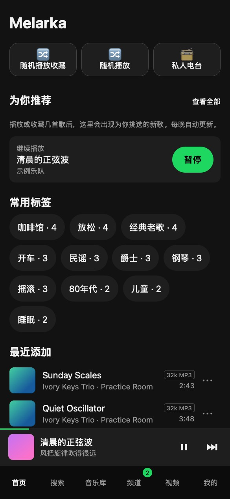
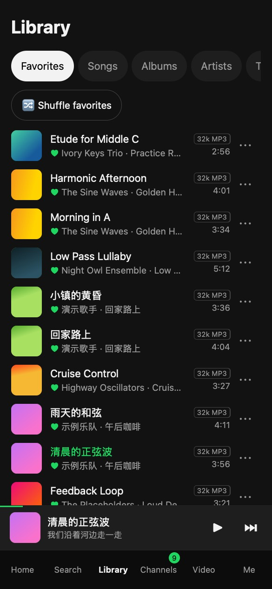
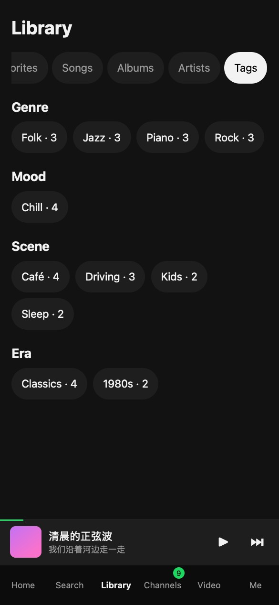
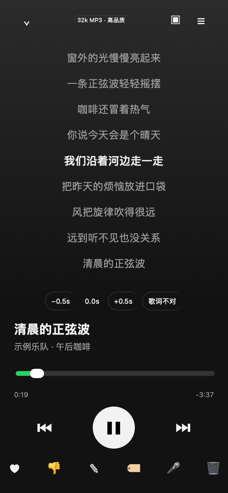
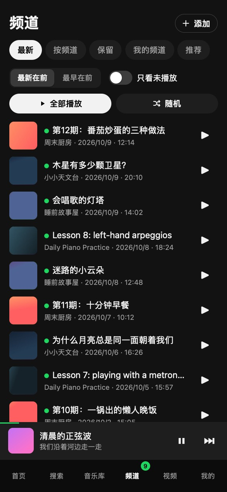
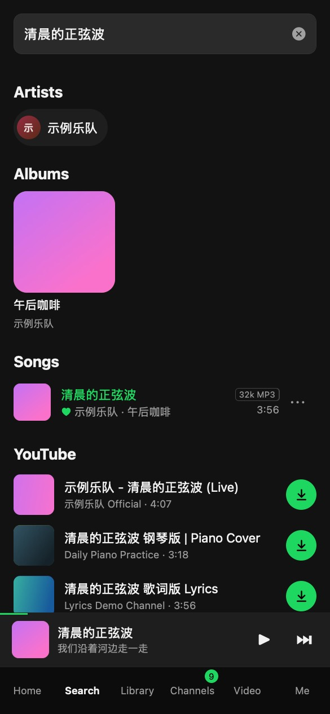
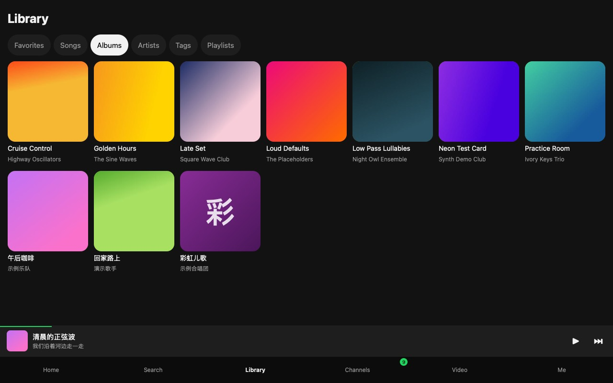

**Melarka** (internal code name `lark`) — a self-hosted music server with a web app and an iPhone app.

# Melarka

Melarka is a music server for a household. Point it at the music folders you already have, and
everyone at home gets their own favorites, playlists, radio and lyrics on their phone, streamed
from your own machine. Your files stay yours: Melarka never rewrites them or their tags. Titles,
tags, lyrics and choices live in Melarka's own database.

It runs as one Docker container. You use it from any browser, from a phone's home screen, or
from the native iPhone app.

> The code, the binary, the environment variables (`LARK_*`) and the database still use the
> internal code name `lark`. Everything you see says Melarka.

Installing with an AI coding agent? Point it at [AGENTS.md](AGENTS.md): the same steps as below,
each followed by a command that checks it worked.

## Screenshots

<!-- SCREENSHOTS -->
<p align="center">
  
  
  
  
  
  
</p>
<p align="center"></p>
<p align="center"><sub>Home · Favorites · Tags · Now Playing · Channels · Search, then a desktop browser.
Demo data: invented songs and channels, generated test tones and covers.</sub></p>
<!-- /SCREENSHOTS -->

## Features

- **Streaming** in three tiers: `lossless` (the original file whenever the player can play it),
  `high` (AAC up to 256 kbps) and `saver` (AAC up to 128 kbps), transcoded on the fly and cached.
- **A web app that installs to the home screen** of a phone and runs full screen, with
  lock-screen controls.
- **An iPhone app** with a native playback engine: background play, gapless transitions, an
  offline cache of your favorites, and Shortcuts to start playing when the car connects.
- **Synced lyrics** from the file itself, a `.lrc` next to it, or online lyrics services.
  Everyone can fix lyrics that run early or late (shift them, or align to the line being sung)
  and report wrong lyrics, which brings up the next best version.
- **Song names fixed without touching files**: admins edit title, artist, album and year as
  overrides, and an optional AI agent skill cleans up messy YouTube names in batches.
- **YouTube**: search, download a song or a whole playlist (up to 200 entries), or paste a link.
  A downloaded playlist becomes a Melarka playlist.
- **Previews**: play any YouTube video before you keep it; **Keep** moves it into your music or
  your channels without a second download.
- **Channels (频道)**: follow YouTube channels without an account. New episodes download by
  themselves and play with resume and speed control; they expire after a while unless kept.
- **Video (视频)**: search and watch YouTube videos through your server, with your own history
  and suggestions. The phone never contacts YouTube directly.
- **For you**: every night Melarka suggests YouTube songs you don't have yet, based on what you
  play and favorite most.
- **Tags**: browse and shuffle by genre, mood, scene, era and language. Tags come from folder
  names, Last.fm, an optional AI agent skill, or by hand.
- **Personal radio**, favorites, playlists, **My downloads**, and search that remembers your last
  20 searches.
- **Offline cache** in the web app too: favorites stay on the phone at `high` quality under a
  size limit you pick, so they keep playing in tunnels and dead zones.
- **Pending → kept**: songs added after the first scan start as *pending*. Three plays keep a
  song automatically; a deleted song waits 30 days in the trash before it is gone.
- **Admin console** for users, pending songs, downloads, trash, libraries and yt-dlp updates.
- **Languages**: English, 简体中文, 繁體中文, svenska. Music metadata is never translated.

## Quick start (5 minutes)

You need a Linux host with Docker (Compose v2) and a directory of music files. Make a directory
for Melarka and save this as `docker-compose.yml` in it. It is
[`deploy/docker-compose.example.yml`](deploy/docker-compose.example.yml), so you can also download
that file:

```yaml
# Melarka: save as docker-compose.yml next to config.yaml and .env (see README "Quick start").
# Then: docker compose up -d
services:
  melarka:
    image: ghcr.io/aaronsuns/melarka:0.1.0       # or :0.1 (patch updates) or :latest
    container_name: melarka
    restart: unless-stopped
    ports:
      - "127.0.0.1:4600:4600"    # loopback only; put an HTTPS reverse proxy in front (README "Reverse proxy and HTTPS")
    env_file: .env               # LARK_ADMIN_PASSWORD=… (first start only); optional LARK_LANGUAGE, LARK_LASTFM_API_KEY
    environment:
      LARK_ADMIN_USER: admin     # the first admin's username, used only while no admin exists
      # TZ: Area/City            # local time for recommendations.refresh_at; UTC if unset
    volumes:
      - ./data:/data                                   # database, caches, the updated yt-dlp copy
      - ./config.yaml:/data/config.yaml:ro
      - ${MUSIC_DIR:-/srv/melarka/music}:/music/main   # your music: set MUSIC_DIR in .env, or edit this line
      - ./youtube:/music/youtube                       # YouTube downloads
      - ./channels:/data/channels                      # followed channels' episodes (can grow large)
      - ./previews:/data/previews                      # temporary previews and video thumbnails
    logging:
      driver: json-file
      options: { max-size: "10m", max-file: "3" }
```

Then, in the same directory, with your music directory as `MUSIC_DIR`:

```bash
curl -fsSL -o config.yaml https://raw.githubusercontent.com/aaronsuns/melarka/main/deploy/config.example.yaml
printf 'MUSIC_DIR=%s\nLARK_ADMIN_PASSWORD=%s\n' /path/to/your/music "$(openssl rand -base64 18)" > .env && chmod 600 .env
mkdir -p data youtube channels previews && sudo chown 1000:1000 data youtube channels previews
docker compose up -d
curl -fsS http://127.0.0.1:4600/api/v1/info    # JSON that includes "name":"Melarka"
```

Open `http://127.0.0.1:4600` on the server, or set up the
[reverse proxy](#reverse-proxy-and-https) to use Melarka from phones.

`config.yaml` works unchanged: it creates two libraries, `main` (`/music/main`, your music) and
`youtube` (`/music/youtube`, where YouTube downloads go). The container runs as uid `1000`, not
root, so the four directories you created must be owned by uid 1000; otherwise Docker creates
them root-owned and Melarka can't write its database. Your music directory must be readable by
uid 1000, and writable too if you want deleting a song to move its file into `.lark-trash/`
instead of failing.

More detail, including building the image yourself, is in [docs/install.md](docs/install.md).

## First login and admin creation

When the database has no admin, Melarka creates one from `LARK_ADMIN_USER` (`admin` above) and
`LARK_ADMIN_PASSWORD` (from `.env`). Once an admin exists, both are ignored, so changing them
later has no effect. If either is missing on that first start, Melarka refuses to start and says so
in its log.

1. Read the generated password back with `grep LARK_ADMIN_PASSWORD .env`.
2. Sign in as `admin`, then change the password in **Me → Change password**.
3. Add the people in your household under **Admin → Users**. Each gets their own favorites,
   playlists, history and language.

## Configuration

Melarka reads environment variables (`LARK_*`) and an optional `config.yaml`.
[`deploy/config.example.yaml`](deploy/config.example.yaml) lists every key at its default; a key
you leave out keeps its default. Every key and variable is described in
[docs/configuration.md](docs/configuration.md).

The ones you are most likely to change:

- `LARK_LANGUAGE` (or `language`): the default UI language, `en`, `zh-Hans`, `zh-Hant` or `sv`.
- `LARK_LASTFM_API_KEY`: turns on tags from Last.fm and Last.fm's similar tracks in **For you**.
- `TZ` in `docker-compose.yml`: the local time of the nightly refresh (UTC if unset).
- `lyrics.providers` and `artwork.providers`: which online sources to ask.
- `channels.enabled`: `false` turns off Channels, previews and Video.

## Reverse proxy and HTTPS

The quick start listens on `127.0.0.1:4600` only. To reach Melarka from phones (and from the
iPhone app, which requires HTTPS), put an HTTPS reverse proxy in front of it.

With **Caddy**, which gets the certificate by itself:

```caddy
music.example.com {
    reverse_proxy 127.0.0.1:4600 {
        flush_interval -1
    }
}
```

With **nginx**, in `/etc/nginx/conf.d/melarka.conf`:

```nginx
limit_req_zone $binary_remote_addr zone=melarka_login:10m rate=10r/m;

server {
    listen 80;
    server_name music.example.com;
    client_max_body_size 1m;

    location / {
        proxy_pass http://127.0.0.1:4600;
        proxy_set_header Host $host;
        proxy_set_header X-Forwarded-For $proxy_add_x_forwarded_for;
        proxy_set_header X-Forwarded-Proto $scheme;
    }
    location /api/v1/tracks/ {              # audio streams: no buffering, long reads
        proxy_pass http://127.0.0.1:4600;
        proxy_set_header Host $host;
        proxy_set_header X-Forwarded-Proto $scheme;
        proxy_buffering off;
        proxy_read_timeout 1h;
    }
    location = /api/v1/auth/login {         # slow down password guessing
        limit_req zone=melarka_login burst=5 nodelay;
        proxy_pass http://127.0.0.1:4600;
        proxy_set_header Host $host;
        proxy_set_header X-Forwarded-Proto $scheme;
    }
}
```

Then get a certificate with `sudo certbot --nginx -d music.example.com`; it adds the HTTPS
listener and the redirect from HTTP. Keep `X-Forwarded-Proto`: the login cookie is marked
`Secure` only when Melarka sees `https` there (Caddy sets it for you).

## Backup, restore and upgrade

**What to back up:**

- `data/lark.db`: everything Melarka knows (users, favorites, playlists, tags, lyrics, history);
- `channels/` and `youtube/`: downloaded episodes and songs;
- `config.yaml`, `docker-compose.yml` and `.env`.

Your own music directory is never changed by Melarka. `data/cache` and `previews/` are
disposable.

**Back up the database safely.** The database runs in WAL mode, so don't copy `lark.db` alone
while Melarka is running. Either make an online backup with the `sqlite3` tool:

```bash
sqlite3 data/lark.db ".backup lark-backup-$(date +%F).db"
```

or stop the container first (`docker compose stop`), copy `data/`, and start it again.

**Restore:**

```bash
docker compose stop
cp lark-backup-YYYY-MM-DD.db data/lark.db
rm -f data/lark.db-wal data/lark.db-shm
sudo chown 1000:1000 data/lark.db
docker compose start
```

**Upgrade:** back up first, then change the image tag in `docker-compose.yml` to the new version
(see the [releases](https://github.com/aaronsuns/melarka/releases) and
[CHANGELOG.md](CHANGELOG.md)), and run:

```bash
docker compose pull && docker compose up -d
```

Database migrations run automatically at start. With the `:latest` tag, the same two commands
upgrade to the newest release.

## The iPhone app (SideStore)

The iPhone app is a native shell around the web app with its own playback engine: reliable
background play, lock-screen and car controls, and an offline cache. It is not in the App Store;
each release ships an unsigned IPA that you install with [SideStore](https://sidestore.io), which
signs it on your phone with your own Apple ID.

1. Install SideStore on the iPhone (once): install **LocalDevVPN** from the App Store, then run
   **iloader** on a computer with the phone connected by USB and choose **Install SideStore**.
2. In SideStore, open **Sources**, tap **+**, and add
   `https://aaronsuns.github.io/melarka/source.json`.
3. Open the Melarka source and install **Melarka**.
4. Open Melarka, enter your server URL (for example `https://music.example.com`), and sign in.

Step-by-step instructions, the 7-day refresh and troubleshooting are in
[docs/iphone.md](docs/iphone.md). Without the app, you can also open your Melarka address in
Safari and tap Share → **Add to Home Screen**.

## Agent skills

Three optional skills let an AI coding agent (such as Claude Code) do tedious library work
through Melarka's API: tag songs, find missing lyrics, and fix messy song names. Melarka itself
calls no paid AI service. See [docs/agent-skills.md](docs/agent-skills.md).

## Responsible use

Melarka is a tool for listening to your own music collection at home.

- **You are responsible for what you download.** The YouTube features use
  [yt-dlp](https://github.com/yt-dlp/yt-dlp). Follow YouTube's Terms of Service and the copyright
  law where you live, and download only what you are allowed to.
- **Melarka ships no content.** No music, lyrics, covers or videos are included.
- **Some lyrics and cover sources are unofficial.** NetEase, QQ Music and Kugou are unofficial
  APIs that may break or change their terms at any time; remove them from `lyrics.providers` and
  `artwork.providers` to switch them off.
- **The phone never contacts YouTube directly**: searches, thumbnails and videos all come through
  your server, which is the only machine that talks to YouTube.

## More documentation

- [docs/install.md](docs/install.md): installing, building from source, file ownership.
- [docs/configuration.md](docs/configuration.md): every environment variable and `config.yaml` key, and how each feature uses them.
- [docs/iphone.md](docs/iphone.md): the iPhone app.
- [docs/agent-skills.md](docs/agent-skills.md): the AI agent skills.
- [docs/architecture.md](docs/architecture.md): how the code is organised, and the HTTP API.
- [CONTRIBUTING.md](CONTRIBUTING.md), [SECURITY.md](SECURITY.md), [CHANGELOG.md](CHANGELOG.md).

## License

Melarka is free software under the **GNU Affero General Public License v3.0 or later** (see
[`LICENSE`](LICENSE) and [`NOTICE`](NOTICE)). If you run a modified version for others over a
network, the AGPL requires you to offer them its source code.

If you want to use Melarka in a product or service without the AGPL's obligations,
**commercial licenses are available from the author**, Aaron Sun: open an issue, or contact
[@aaronsuns](https://github.com/aaronsuns) on GitHub.

Contributions are accepted under the [Contributor License Agreement](CLA.md); CLA Assistant asks
you to sign it on your first pull request. See [`CONTRIBUTING.md`](CONTRIBUTING.md).
